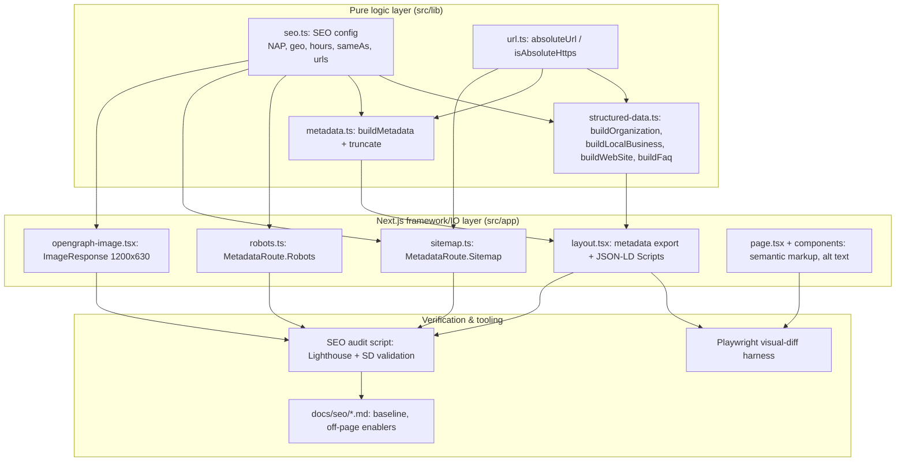

# Design Document

## Overview

This design closes the remaining technical and local-SEO gaps for the TheClientPilot (TCP) single-page Next.js 16 (App Router) site deployed on Vercel, without altering any rendered visual or visible copy. All work targets the "under the hood" layer: metadata, structured data, crawler-control files, non-rendering semantic attributes, image alt text, performance hints, and a repeatable audit mechanism.

The central architectural move is to introduce a single source of truth for all SEO data — a typed config module (`src/lib/seo.ts`) — and a set of pure builder functions that turn that config into the artifacts search engines consume (JSON-LD blocks, `Metadata`, robots, sitemap). Centralizing the data removes today's duplication between `layout.tsx`'s Organization and LocalBusiness blocks and makes the "omit-when-unavailable" rule (Req 5.8) and NAP-consistency rule (Req 6.5) enforceable in one place and testable as pure functions.

The design is deliberately split into two layers:

- **Pure logic layer** — config, schema builders, URL/format helpers, metadata truncation. This layer has clear input/output behavior and is the target of property-based testing (structured data always valid regardless of which owner fields are present, absolute-URL invariants, metadata length bounds, NAP consistency).
- **Framework/IO layer** — Next.js `MetadataRoute` files, `opengraph-image` generation, `<Script>` injection, image serving. This layer is verified with example/integration tests, snapshot checks, and the Lighthouse-based audit.

Because the hard constraint is "no visual change," a Playwright-based visual-diff harness (Playwright is already a devDependency) is the acceptance gate for every change: pre-change and post-change screenshots at viewport widths from 320px to 1920px must be pixel-identical (Req 1).

### Requirements addressed

| Area | Requirements |
|------|-------------|
| No-visual-change constraint | 1, 8.4, 8.6, 8.7, 9.3, 10.5, 10.7 |
| Robots file | 2 |
| Sitemap file | 3 |
| Raster OG image | 4 |
| LocalBusiness completeness | 5, 12.1, 12.2 |
| Structured-data validity & consistency | 6 |
| Metadata optimization | 7 |
| Semantic markup / single h1 | 8 |
| Image alt audit | 9 |
| Core Web Vitals | 10 |
| SEO scoring / baseline | 11 |
| Off-page enablers docs | 12 |

## Architecture



### Key design decisions

1. **Single SEO config module (`src/lib/seo.ts`).** All NAP (Name/Address/Phone), geo, opening hours, `sameAs`, verification token, and canonical URL live in one typed object. Rationale: eliminates the current duplication and enforces NAP consistency (Req 6.5) and single-source omission (Req 5.8) structurally. Owner-provided fields are optional in the type; unavailable = `undefined`.

2. **Builders are pure functions.** `buildOrganization(config)`, `buildLocalBusiness(config)`, etc., take config and return plain JSON-LD objects. Rationale: makes them unit- and property-testable independent of Next.js, and lets the "omit-when-unavailable" and "always-valid" behaviors be verified across all subsets of owner data.

3. **Next.js file conventions for robots/sitemap/OG.** Use `app/robots.ts` (`MetadataRoute.Robots`), `app/sitemap.ts` (`MetadataRoute.Sitemap`), and `app/opengraph-image.tsx` (`ImageResponse`). Rationale: framework-native, correct content types and caching, deployed on Vercel with zero extra config. `ImageResponse` produces a real 1200x630 PNG, satisfying Req 4 without hand-authoring a binary asset. A static `public/seo/og.png` fallback is documented as an alternative if generated-image build cost is a concern.

4. **Metadata truncation is a build-time pure helper, not runtime edit of copy.** Title/description are metadata strings, not on-page copy. A `clampText(value, max)` helper trims to the limit at a word boundary. Rationale: satisfies Req 7.3/7.4 while provably never touching `page.tsx`/component copy.

5. **Single-h1 correction via heading-level change only.** The two `<h1>` in `Hero.tsx` become one `<h1>` (semantic container) with the visual styling preserved via the existing `display` class applied to the retained element and non-heading elements (e.g., `<span>`/`role`) for the demoted parts; the `sr-only` `<h1>` in `page.tsx` is demoted to `<h2>` (or `<p role>` under a wrapper) so heading order stays sequential. Rationale: the `display` class carries all visual styling, so changing the tag name while keeping the class yields zero pixel change (Req 8.4–8.7, Req 1.4).

6. **Playwright visual-diff harness as the acceptance gate.** Rationale: Req 1 mandates pixel-identical output; Playwright's `toHaveScreenshot` with `maxDiffPixels: 0` across a set of widths (320, 375, 414, 768, 1024, 1280, 1920) operationalizes "zero differing pixels."

7. **Lighthouse-based audit script recorded to docs.** A documented npm script runs Lighthouse (SEO + performance categories) and a structured-data validation step, writing timestamped JSON/markdown to `docs/seo/`. Rationale: Req 11 requires a re-runnable, recorded, baseline-comparable audit.

### Research notes

- **Next.js `MetadataRoute`.** `app/robots.ts` exporting a default function returning `MetadataRoute.Robots` produces `/robots.txt` as `text/plain`; `app/sitemap.ts` returning `MetadataRoute.Sitemap` produces `/sitemap.xml` as `application/xml`, UTF-8, sitemaps.org-conformant. Both are static by default (fast, well under the 1000ms budget in Req 2.1/3.1). Source: Next.js App Router metadata files documentation (nextjs.org/docs/app/api-reference/file-conventions/metadata).
- **`opengraph-image.tsx` + `ImageResponse`.** Returns a PNG at the size specified in the exported `size` (`{ width: 1200, height: 630 }`), served with `content-type: image/png`. Next.js auto-wires the OG/Twitter image URL to absolute form via `metadataBase`. Source: Next.js `opengraph-image` file convention docs.
- **JSON-LD validity.** Google Rich Results tooling and the schema.org vocabulary define required/recommended properties. `LocalBusiness` recommends `address`, `telephone`, `geo`, `openingHoursSpecification`, `image`; validity does not require optional properties, so omitting unavailable owner fields keeps the block valid (aligns with Req 5.8/5.9). Content was rephrased for compliance with licensing restrictions.
- **Playwright screenshots.** `expect(page).toHaveScreenshot(name, { maxDiffPixels: 0 })` fails on any pixel difference; multiple `page.setViewportSize` calls cover the 320–1920 range. Playwright is already installed.

## Components and Interfaces

### 1. SEO config module — `src/lib/seo.ts`

Single source of truth. Required fields are always present; owner-provided fields are optional and `undefined` when unavailable.

```ts
export interface OpeningHours {
  dayOfWeek: string[];      // e.g. ["Monday","Tuesday"]
  opens: string;            // "HH:MM" 24h
  closes: string;           // "HH:MM" 24h
}

export interface SeoConfig {
  siteUrl: string;                 // "https://theclientpilot.store" (no trailing slash)
  siteName: string;                // "TheClientPilot"
  canonicalUrl: string;            // === siteUrl for the home page
  title: string;                   // source title (may exceed 60)
  description: string;             // source description (may exceed 160)
  ogImagePath: string;             // "/opengraph-image" or "/seo/og.png"
  ogImageAlt: string;              // 1..420 chars
  googleVerification?: string;     // Search Console token
  // NAP (owner-provided; omit when undefined)
  addressLocality: string;         // "Guwahati" (known)
  addressRegion: string;           // "Assam" (known)
  addressCountry: string;          // "IN" (known)
  postalCode?: string;
  streetAddress?: string;
  telephone?: string;              // E.164, +<=15 digits
  geo?: { latitude: number; longitude: number };
  openingHours?: OpeningHours[];
  sameAs?: string[];               // absolute https URLs
  areaServed: string[];            // Guwahati, Assam, Northeast India, India
}

export const seoConfig: SeoConfig;
```

- Addresses: Req 5 (all fields), Req 7.1/7.7, Req 12.1.
- The single object guarantees NAP identity between Organization and LocalBusiness (Req 6.5) because both builders read the same fields.

### 2. URL helpers — `src/lib/url.ts`

```ts
export function isAbsoluteHttps(url: string): boolean;   // begins https:// + host
export function absoluteUrl(path: string, base: string): string; // join, canonical, no double slash
export function canonicalHome(base: string): string;     // base with no trailing slash
```

- Addresses: Req 2.3/2.4, Req 3.5, Req 4.2/4.3, Req 5.5/5.6, Req 6.4, Req 7.1.

### 3. Structured-data builders — `src/lib/structured-data.ts`

```ts
export function buildOrganization(c: SeoConfig): object;
export function buildWebSite(c: SeoConfig): object;
export function buildLocalBusiness(c: SeoConfig): object; // ProfessionalService + LocalBusiness
export function buildFaqPage(c: SeoConfig): object;
export function buildAllStructuredData(c: SeoConfig): object[];
```

Behavior:
- Every `url`/`logo`/`image`/`sameAs` value is passed through `absoluteUrl`/validated by `isAbsoluteHttps` (Req 6.4).
- `buildLocalBusiness` conditionally includes `streetAddress`, `telephone`, `geo`, `openingHoursSpecification`, `sameAs` only when the corresponding config field is defined and non-empty; otherwise the property is omitted entirely (Req 5.8).
- `geo`, `telephone`, and `openingHoursSpecification` values are only emitted when they satisfy the range/format constraints (Req 5.2/5.3/5.4/5.9).
- Organization and LocalBusiness read identical NAP + telephone from config (Req 6.5).
- `image` references the raster OG image absolute URL, never the SVG (Req 5.6, Req 6.7).

### 4. Metadata builder — `src/lib/metadata.ts`

```ts
export function clampText(value: string, max: number): string; // trims to <= max, word-boundary
export function buildMetadata(c: SeoConfig): Metadata;
```

- `title` clamped to ≤60, `description` clamped to ≤160 (Req 7.3/7.4).
- Exactly one `alternates.canonical` = `canonicalUrl` (Req 7.1/7.2).
- `robots.index = true`, `robots.follow = true` (Req 7.5).
- `verification.google = c.googleVerification` when present; exactly one token (Req 7.7/7.8).
- OG/Twitter `images` reference the raster OG image with width 1200, height 630, non-empty alt ≤420 (Req 4.2/4.3/4.4).

### 5. Robots route — `src/app/robots.ts`

```ts
export default function robots(): MetadataRoute.Robots
```

- `rules`: `{ userAgent: "*", allow: "/", disallow: ["/api/", "/_next/"] }` (Req 2.2/2.5).
- `sitemap: "https://theclientpilot.store/sitemap.xml"` (Req 2.3, Req 12.6).
- `host: "https://theclientpilot.store"` (Req 2.4).
- Static generation → `text/plain`, 200, fast (Req 2.1). Framework returns 5xx on generation failure (Req 2.6).

### 6. Sitemap route — `src/app/sitemap.ts`

```ts
export default function sitemap(): MetadataRoute.Sitemap
```

- Exactly one entry: `{ url: canonicalHome(base), lastModified: <ISO8601> }` (Req 3.3/3.4/3.5).
- Framework emits well-formed UTF-8 XML, `application/xml`, 200 (Req 3.1/3.2), 5xx on failure (Req 3.6).

### 7. OG image — `src/app/opengraph-image.tsx`

```ts
export const size = { width: 1200, height: 630 };
export const contentType = "image/png";
export default function Image(): ImageResponse
```

- Produces a 1200x630 PNG < 5MB (Req 4.1/4.5). Non-2xx path returns HTTP error, not image content (Req 4.6).
- **Alternative** documented in Testing Strategy: commit a static `public/seo/og.png` and point metadata at it. Chosen approach is generated to avoid committing binaries, but must not embed visible-page copy.

### 8. Semantic markup fix — `src/components/Hero.tsx`, `src/app/page.tsx`

- Consolidate the two `<h1>` in `Hero.tsx` into a single `<h1>` wrapper; the second visible line ("agency") becomes a non-heading element (`<span>`/`<div>`) carrying the identical `display` class (Req 8.1, 8.5, 8.6).
- Demote the `sr-only` `<h1>` in `page.tsx` to `<h2>` (or remove) so heading order is sequential; `sr-only` keeps it non-visual (Req 8.7, Req 1.3).
- Keep exactly one `<main>` (already present) (Req 8.2).
- Ensure descending heading levels never skip more than one level (Req 8.3).

### 9. Image alt audit — `src/lib/image-audit.ts` (dev/test utility) + component edits

- Enumerate rendered images; classify content vs decorative; assert content images have 1–125 char alt, decorative have `alt=""` (Req 9.1/9.2).
- Report non-compliant images without altering render (Req 9.4). Alt edits are attribute-only (Req 9.3).

### 10. Performance — component/config hints

- Content images use `next/image` with explicit width/height and modern formats (WebP/AVIF via Next image optimization) (Req 10.4/10.6). Fallback to original format when next-gen unavailable (Req 10.7).
- Any perf change that would alter render is excluded (Req 10.5). Targets validated by the audit (Req 10.1/10.2/10.3).

### 11. Audit tooling — `scripts/seo-audit.mjs` + `docs/seo/`

- Documented npm script runs Lighthouse (SEO + CWV) against each indexable URL and a structured-data validation step; writes timestamped result to `docs/seo/audits/`.
- First run = baseline; later runs compared against baseline (Req 11.1–11.9).
- `docs/seo/off-page-enablers.md` documents GBP creation, review acquisition, citation building, the no-guarantee statement, and sitemap submission URL (Req 12.4/12.5/12.6/12.7).

## Data Models

### JSON-LD LocalBusiness (shape when all owner fields present)

```jsonc
{
  "@context": "https://schema.org",
  "@type": ["ProfessionalService", "LocalBusiness"],
  "name": "TheClientPilot",
  "url": "https://theclientpilot.store",
  "image": "https://theclientpilot.store/opengraph-image",
  "telephone": "+91XXXXXXXXXX",            // omitted if unavailable
  "priceRange": "$$",
  "address": {
    "@type": "PostalAddress",
    "streetAddress": "…",                  // omitted if unavailable
    "addressLocality": "Guwahati",
    "addressRegion": "Assam",
    "postalCode": "…",                     // omitted if unavailable
    "addressCountry": "IN"
  },
  "geo": {                                  // whole block omitted if unavailable
    "@type": "GeoCoordinates",
    "latitude": 26.14,
    "longitude": 91.73
  },
  "openingHoursSpecification": [            // omitted if unavailable
    { "@type": "OpeningHoursSpecification",
      "dayOfWeek": ["Monday","Tuesday","Wednesday","Thursday","Friday"],
      "opens": "10:00", "closes": "19:00" }
  ],
  "sameAs": ["https://…"],                  // omitted if empty
  "areaServed": [ /* Guwahati, Assam, Northeast India, India */ ]
}
```

### Audit record (`docs/seo/audits/<timestamp>.json`)

```jsonc
{
  "timestamp": "2024-01-01T00:00:00Z",
  "isBaseline": true,
  "pages": [
    {
      "url": "https://theclientpilot.store",
      "seoScore": 96,
      "coreWebVitals": { "lcpMs": 2100, "cls": 0.02, "inpMs": 150 },
      "structuredDataValid": true,
      "structuredDataErrors": []
    }
  ]
}
```

### Format constraints (validated in builders/helpers)

| Field | Constraint | Requirement |
|-------|-----------|-------------|
| `telephone` | `^\+\d{1,15}$` (E.164, ≤15 digits) | 5.3 |
| `geo.latitude` | −90 ≤ x ≤ 90 | 5.2 |
| `geo.longitude` | −180 ≤ x ≤ 180 | 5.2 |
| `opens`/`closes` | `HH:MM` 24h | 5.4 |
| `dayOfWeek` | Monday…Sunday | 5.4 |
| any url/image/sameAs | starts `https://` + host | 4.2, 5.5, 5.6, 6.4 |
| title | 1..60 chars | 7.3 |
| description | 1..160 chars | 7.3 |
| ogImageAlt | 1..420 chars | 4.4 |
| sitemap `lastModified` | ISO 8601 | 3.4 |

## Correctness Properties

*A property is a characteristic or behavior that should hold true across all valid executions of a system — essentially, a formal statement about what the system should do. Properties serve as the bridge between human-readable specifications and machine-verifiable correctness guarantees.*

The pure logic layer (config, builders, helpers) is the target of property-based testing. Each property below was derived from the prework analysis and consolidated to remove redundancy (for example, the many "absolute https URL" criteria collapse into a single comprehensive URL invariant, and the geo/telephone/hours format criteria collapse into a single LocalBusiness validity property).

### Property 1: Unavailable owner fields are omitted, never emitted empty

*For any* SeoConfig with an arbitrary subset of the owner-provided fields (`streetAddress`, `postalCode`, `telephone`, `geo`, `openingHoursSpecification`, `sameAs`) present or absent, the structured-data blocks produced by the builders SHALL contain no property whose value is empty, null, or a placeholder; every unavailable field SHALL be represented by an absent key rather than an empty value.

**Validates: Requirements 5.8**

### Property 2: Every URL-bearing field is an absolute https URL

*For any* SeoConfig, every URL value emitted by the builders and metadata builder — including each `url`, `logo`, `image`, `sameAs` entry across all four structured-data blocks, the OpenGraph image URL, the Twitter Card image URL, the canonical URL, the robots host and sitemap declarations, and each sitemap entry URL — SHALL begin with the `https://` scheme, include a host, and (for canonical/sitemap URLs) carry no trailing slash beyond the domain root.

**Validates: Requirements 3.5, 4.2, 4.3, 5.5, 5.6, 6.4, 2.3, 2.4, 7.1**

### Property 3: LocalBusiness values conform to their format and range constraints

*For any* SeoConfig, every value the LocalBusiness builder emits SHALL conform to its constraint: an emitted `telephone` matches E.164 (`+` followed by at most 15 digits); an emitted `geo` has latitude in [−90, 90] and longitude in [−180, 180]; each emitted `openingHoursSpecification` entry has `dayOfWeek` values drawn from Monday–Sunday and `opens`/`closes` in 24-hour `HH:MM` notation; and any field that cannot satisfy its constraint is omitted rather than emitted malformed.

**Validates: Requirements 5.2, 5.3, 5.4, 5.9**

### Property 4: Each block contains its schema.org-required properties

*For any* SeoConfig, each structured-data block SHALL include the properties schema.org marks as required for its declared type, and the LocalBusiness address SHALL always include `addressLocality` = Guwahati, `addressRegion` = Assam, and `addressCountry` = IN.

**Validates: Requirements 5.1, 6.1**

### Property 5: NAP values are identical across Organization and LocalBusiness

*For any* SeoConfig, the business name, postal address fields, and primary telephone emitted in the Organization block SHALL be character-identical (after trimming leading and trailing whitespace) to the corresponding values in the LocalBusiness/ProfessionalService block.

**Validates: Requirements 6.5**

### Property 6: Metadata single-value invariants hold

*For any* SeoConfig, the produced `Metadata` SHALL declare exactly one canonical URL equal to `canonicalUrl`, `robots` directives with `index = true` and `follow = true`, at most one Google verification token (exactly one when a token is configured), and an OpenGraph image with width 1200, height 630 and a non-empty alt of at most 420 characters.

**Validates: Requirements 4.4, 7.1, 7.5, 7.7**

### Property 7: Title and description are clamped within length bounds

*For any* non-empty source title and description of arbitrary length, the metadata builder SHALL produce a rendered title of between 1 and 60 characters inclusive and a rendered description of between 1 and 160 characters inclusive, derived from (a prefix of) the source without introducing characters not present in the source.

**Validates: Requirements 7.3, 7.4**

### Property 8: Image alt audit classifies and flags correctly

*For any* set of image descriptors, the audit SHALL accept a content image only when its `alt` is between 1 and 125 characters, SHALL accept a decorative image only when its `alt` is the empty string, and SHALL flag exactly those content images that have a missing or empty `alt`.

**Validates: Requirements 9.1, 9.2, 9.4**

### Property 9: Heading order never skips more than one level

*For any* sequence of heading levels, the heading-order checker SHALL report the sequence as valid if and only if, reading in document order, no heading is more than one level deeper than the nearest preceding heading.

**Validates: Requirements 8.3**

### Property 10: Audit scoring classification is correct

*For any* list of structured-data errors and any SEO score in 0–100, the audit SHALL classify structured-data validity as valid if and only if the error list is empty, and SHALL classify the score as meeting the target if and only if it is at least 95.

**Validates: Requirements 11.3, 11.8**

### Property 11: GBP-readiness validation returns the exact missing-field set

*For any* SeoConfig, the GBP-readiness validator SHALL report readiness as satisfied if and only if business name, postal address, telephone, and a non-empty `sameAs` are all present, and otherwise SHALL return exactly the set of those fields that are missing.

**Validates: Requirements 12.1, 12.2**

## Error Handling

- **Robots/sitemap generation failure (Req 2.6, 3.6).** The route functions are pure and deterministic; if an unexpected error is thrown, Next.js serves a 5xx response and no partial body is emitted. The functions never emit partial/malformed directives — they construct the full object then return it atomically.
- **OG image failure (Req 4.6).** If `ImageResponse` generation throws, the route returns an HTTP error status (≥400) rather than image content typed `image/png`/`image/jpeg`. The static-PNG fallback path is a documented mitigation.
- **Unavailable owner data (Req 5.8).** Builders treat `undefined`/empty as "omit the property," guaranteeing a valid schema regardless of which owner values exist. This is the core resilience behavior (Property 1).
- **Structured-data validation errors (Req 6.3, 6.6, 6.8).** The self-check/validation step returns structured errors identifying: the entity type and missing required property; the inconsistent NAP property with both conflicting values; and any unreachable image URL. These are reported, not silently swallowed.
- **Metadata conflicts (Req 7.2, 7.8).** The validation step flags duplicate/differing canonical declarations and duplicate verification tokens as non-compliant.
- **Audit failure (Req 11.6).** If an audit run fails or produces no score, previously recorded results are retained unchanged and an error indication describing the failure is returned.
- **Sitemap unavailable at submission (Req 12.7).** The submission helper surfaces an unavailability indication rather than submitting a broken URL.
- **Visual regression (Req 1.5, 1.6).** The visual-diff gate rejects any change producing ≥1 differing pixel or a visible-content change; a rejected optimization is reverted and the rejection recorded.

## Testing Strategy

### Dual approach

- **Property-based tests** verify the 11 universal properties above across many generated inputs (arbitrary owner-field subsets, arbitrary URLs/paths, arbitrary title/description lengths, arbitrary image sets, arbitrary heading sequences, arbitrary scores/error lists).
- **Example and integration tests** verify concrete artifacts, framework behavior, HTTP responses, and the no-visual-change constraint.

### Property-based testing

PBT **is applicable** to this feature's pure logic layer: the SEO config builders, URL/format helpers, metadata clamp, image-audit function, heading-order checker, and audit classification are pure functions with clear input/output behavior and universal properties.

- **Library:** `fast-check` (the standard PBT library for the TypeScript/Node ecosystem). Do not implement PBT from scratch.
- **Iterations:** each property test runs a minimum of 100 iterations.
- **Tagging:** each property test is tagged with a comment in the format
  `Feature: seo-ranking-optimization, Property {number}: {property_text}`
  and maps 1:1 to a property in the Correctness Properties section (11 property tests total).
- **Generators:** custom `fast-check` arbitraries for `SeoConfig` (independently toggling each owner field present/absent and valid/invalid), for URLs and paths, for title/description strings (including overlong), for image descriptor sets, and for heading-level sequences.

### Example / unit tests (non-PBT criteria)

- Robots object: wildcard allow, disallow `/api/` + `/_next/`, sitemap + host values (Req 2.2, 2.3, 2.4, 2.5).
- Sitemap object: exactly one entry, canonical home URL, ISO-8601 `lastModified` (Req 3.3, 3.4).
- `areaServed` contains Guwahati/Assam/Northeast India/India (Req 5.7).
- Validation-step error messages for missing required property, inconsistent NAP, duplicate canonical, duplicate verification (Req 6.3, 6.6, 7.2, 7.8).
- Metadata `lang="en"`, single verification token present (Req 7.6, 7.7, 12.3).
- Audit record fields, timestamp, baseline flagging, baseline-vs-post comparison, failure retention, fallback-format handling (Req 11.2, 11.4, 11.5, 11.6, 10.7).
- Sitemap submission URL value and unavailable indication (Req 12.6, 12.7).

### Integration / HTTP tests

- `/robots.txt` → 200, `text/plain`, <1000ms (Req 2.1); 5xx-on-failure path (Req 2.6).
- `/sitemap.xml` → 200, well-formed UTF-8 XML, `application/xml`, <1000ms (Req 3.1, 3.2); 5xx-on-failure (Req 3.6).
- OG image → 1200×630, PNG/JPG, <5MB, 200 within 2s, error path ≥400 (Req 4.1, 4.5, 4.6).
- Structured-data validator against the rendered page → zero errors across four blocks (Req 6.2); image URLs reachable 200 within 5s, unreachable flagged (Req 6.7, 6.8).
- Content images served WebP/AVIF; original-format fallback (Req 10.4, 10.7).

### Rendered-DOM / semantic tests (Playwright)

- Exactly one `<h1>` and exactly one `<main>` in the rendered document (Req 8.1, 8.2).
- Rendered heading sequence passes the heading-order checker (Req 8.3).

### Visual-regression gate (the no-visual-change acceptance gate)

- Playwright `toHaveScreenshot` with `maxDiffPixels: 0` at viewport widths 320, 375, 414, 768, 1024, 1280, 1920, comparing pre-change and post-change renders (Req 1.1–1.4, 8.4–8.7, 9.3, 10.5).
- Visible text-node comparison confirms no added/removed/modified visible copy (Req 1.2).
- Any change failing the gate is reverted and the rejection recorded (Req 1.5, 1.6).

### Lighthouse audit (performance + score)

- Documented, re-runnable npm script runs a Lighthouse mobile lab audit (simulated mobile, default throttling) plus structured-data validation, writing timestamped records to `docs/seo/audits/`.
- Asserts LCP ≤ 2.5s, CLS ≤ 0.1, INP (or lab proxy) ≤ 200ms, images have explicit width/height matching aspect ratio, and SEO score ≥ 95 (Req 10.1, 10.2, 10.3, 10.6, 11.1, 11.7).
- Re-runs against an unchanged site differ by ≤ 3 points (Req 11.9).

### Documentation artifacts (smoke checks)

- `docs/seo/off-page-enablers.md` present and contains GBP creation, review acquisition, and citation-building sections, the no-guarantee statement enumerating GBP/reviews/backlinks/competition, and the sitemap submission URL (Req 12.4, 12.5, 12.6).
- `docs/seo/README.md` documents the audit command/procedure (Req 11.9).
